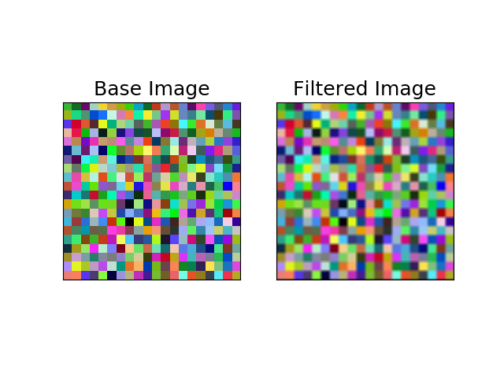

.. _example_averaging:

Example: Averaging Filter
=========================

.. contents:: :local:

Objective
---------

We will blur a given image using an Averaging filter. 
The filter size is 19 :math:`\times` 19, and its coefficients are uniformly :math:`\frac{1}{19 \times 19}`.

Program
-------

.. code-block:: python

    from PIL import Image
    import nlcpy as vp
    from matplotlib import pyplot as plt
    
    def create_image(nx ,ny, nb):
        rng = vp.random.default_rng(seed=0)
        im = vp.empty((ny, nx, 3), dtype='u4')
        dx = nx // nb
        dy = ny // nb
        for w in range(0, nx, dx):
            for h in range(0, ny, dy):
                pixel = rng.integers(0, 255, 3)
                im[h:h+dy, w:w+dx] = pixel
        return im
    
    def zero_padding(im, kw, kh):
        ex = kw // 2
        ey = kh // 2
        sx = im.shape[1] + ex * 2
        sy = im.shape[0] + ey * 2
        im_new = vp.zeros((sy, sx, im.shape[2]), dtype=im.dtype)
        im_new[ey:-ey, ex:-ex] = im
        return im_new
    
    def save_image(im_in, im_out, path=''):
        fig = plt.figure()
        ax1 = fig.add_subplot(121)
        ax2 = fig.add_subplot(122)
        
        ax1.set_title('Base Image', fontsize=18)
        ax2.set_title('Filtered Image', fontsize=18)
        
        ax1.set_xticks([])
        ax1.set_yticks([])
        ax2.set_xticks([])
        ax2.set_yticks([])
        
        # Here, im_in and im_out must be transferred from Vector Engine 
        # to Vector Host by get()
        # because ndarray of NLCPy does not support dtype='u1'.
        # Please note that both im_in.get() and im_out.get() return a 
        # NumPy ndarrays.
        im_in_np = im_in.get().astype('u1')
        im_out_np = im_out.get().astype('u1')
        im_in = Image.fromarray(im_in_np)
        im_out = Image.fromarray(im_out_np)
    
        ax1.imshow(im_in)
        ax2.imshow(im_out)
        
        plt.savefig(path)
    
    def create_kernel(kw, kh):
        kernel = vp.empty((kh, kw), dtype='f8')
        kernel.fill(1. / kernel.size)
        return kernel
    
    def convolve(im, kernel):
        ex = kernel.shape[1] // 2
        ey = kernel.shape[0] // 2
        im_filtered = vp.zeros_like(im)[ey:-ey, ex:-ex]
        im_filtered = im_filtered.astype(dtype='f8', copy=True)
        ix = im.shape[1] - kernel.shape[1] + 1
        iy = im.shape[0] - kernel.shape[0] + 1
        for w in range(kernel.shape[1]):
            for h in range(kernel.shape[0]):
                im_filtered[...] += im[h:iy+h, w:ix+w] * kernel[h, w]
        return im_filtered
    
    def averaging_filter(
            nx, # The number of pixels in x-direction for creating image.
            ny, # The number of pixels in y-direction for creating image.
            nb, # The number of blocks in each axis for creating image.
            kw, # The kernel width. 
            kh, # The kernel height. 
    ):
        print("creating image...", end="", flush=True)
        im_in = create_image(nx ,ny, nb)
        print("done", flush=True)
        
        print("smoothing image...", end="", flush=True)
        im_padded = zero_padding(im_in, kw, kh)
        kernel = create_kernel(kw, kh)
        im_out = convolve(im_padded, kernel)
        print("done", flush=True)
        
        print("saving image...", end="", flush=True)
        save_image(im_in, im_out, './averaging_filter.png')
        print("done", flush=True)
    
    if __name__ == "__main__":
        averaging_filter(1000, 1000, 20, 19, 19)

Result
------

