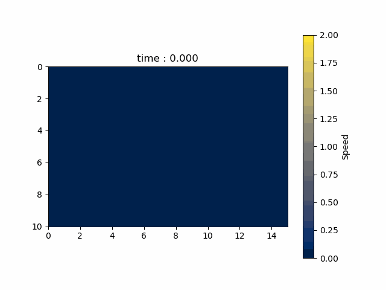

.. _example_cfd:

Example: Fluid Simulation
=========================

.. contents:: :local:

Objective
---------

We will visualize a Karman vortex street by solving the Navier-Stokes equations.

Physics
-------

Navier-Stokes Equations
^^^^^^^^^^^^^^^^^^^^^^^

.. math::

    \frac{\partial \boldsymbol{u}}{\partial t} + (\boldsymbol{u} \cdot \nabla)\boldsymbol{u} = - \frac{1}{\rho} \nabla p + \frac{\mu}{\rho} \nabla^2 \boldsymbol{u}

where :math:`\boldsymbol{u}` is the flow velocity vector field,
:math:`t` is the time, :math:`p` is the pressure, :math:`\rho` is the density,
and :math:`\mu` is the viscosity.

To simplify the simulation, we adopt the following dimensionless equations.

.. math::

    \frac{\partial \boldsymbol{u}}{\partial t} + (\boldsymbol{u} \cdot \nabla)\boldsymbol{u} = - \nabla p + \frac{1}{Re} \nabla^{2} \boldsymbol{u}

where :math:`Re` is the Reynolds number.

.. math::

    Re = \frac{\rho V L}{\mu}

where :math:`V` is the representative speed and :math:`L` is the representative length.

Continuity Equations
^^^^^^^^^^^^^^^^^^^^

.. math::

    \nabla \cdot \boldsymbol{u} = 0

Chorin's Projection Method
^^^^^^^^^^^^^^^^^^^^^^^^^^

We use the Chorin's projection method [1]_ [2]_ for solving the Navier-Stokes equations.
For details of the method, please refer to the following lists.

.. [1] Chorin, A. J. (1967), “The numerical solution of the Navier-Stokes equations for an incompressible fluid”, *Bull. Am. Math. Soc.* **73**: 928–931

.. [2] Chorin, A. J. (1968), “Numerical Solution of the Navier-Stokes Equations”, *Math. Comp.* **22**: 745–762, doi:10.1090/s0025-5718-1968-0242392-2

In this example, the following computation flow will be repeated
for the number of time steps.

1.  Determine the temporary flow velocity :math:`\boldsymbol{u}^{\star}`

    .. math::
        :nowrap:

        \begin{equation}
          \boldsymbol{u}^{\star}=\boldsymbol{u}^{n}-\Delta t(\boldsymbol{u}^n \cdot \nabla)\boldsymbol{u}^{n}+\frac{\Delta t}{Re}\nabla^2\boldsymbol{u}^{n} \tag{A}
        \end{equation}

    where :math:`\boldsymbol{u}^{n}` is the flow velocity at the time step :math:`n`.

2.  Determine the pressure :math:`p^{n+1}` by solving the Poisson equation

    .. math::
        :nowrap:

        \begin{equation}
          \nabla^2 p^{n+1} = \frac{\nabla \cdot \boldsymbol{u}^{\star}}{\Delta t} \tag{B}
        \end{equation}

    To solve this Poisson equation, we use the Jacobi method.

3.  Determine the flow velocity :math:`\boldsymbol{u}^{n+1}`

    .. math::
        :nowrap:

        \begin{equation}
          \boldsymbol{u}^{n+1} = \boldsymbol{u}^{\star} - \Delta t \nabla p^{n+1} \tag{C}
        \end{equation}

Boundary Conditions
^^^^^^^^^^^^^^^^^^^

.. csv-table::
    :header: "Boundary", "Flow Velocity", "Pressure"
    :widths: 20, 10, 10

    "Injection(:math:`x=0, y=0, y=LY`)", ":math:`0.9, 0.1`", ":math:`0`"
    "Leak(:math:`x=LX`)", ":math:`\frac{\partial \boldsymbol{u}}{\partial x}=0`", ":math:`\frac{\partial p}{\partial x}=0`"
    "Object Surface", ":math:`(0, 0)`", ":math:`\frac{\partial p}{\partial x}=0, \frac{\partial p}{\partial y}=0`"
    "Object Inner", ":math:`(0, 0)`", ":math:`0`"

Program
-------

.. code-block:: python

    import nlcpy as vp
    from matplotlib import pyplot as plt
    from matplotlib import animation

    Re = 100
    DX = .01
    DY = .01
    DT = .002
    NT = 30000
    PLOT_INTERVAL = 500
    LX = 15.
    LY = 10.
    NX = int((LX // DX) + 1)
    NY = int((LY // DY) + 1)
    U_INJ = .9
    V_INJ = .1

    MAX_ITER_JACOBI = 50
    TOL_JACOBI = 1e-3

    OBJ_X_BEGIN = int(NX // 4)
    OBJ_X_END = int(NX // 4 + NX // 15)
    OBJ_Y_BEGIN = int(NY // 2 - NY // 10)
    OBJ_Y_END = int(NY // 2 + NY // 10)
    OBJ_X_IND = slice(OBJ_X_BEGIN, OBJ_X_END + 1)
    OBJ_X_INNER_IND = slice(OBJ_X_BEGIN + 1, OBJ_X_END)  # exclude surface
    OBJ_Y_IND = slice(OBJ_Y_BEGIN, OBJ_Y_END + 1)
    OBJ_Y_INNER_IND = slice(OBJ_Y_BEGIN + 1, OBJ_Y_END)  # exclude surface

    DTYPE = 'float32'

    def init():
        u = vp.sca.create_optimized_array((NY, NX), dtype=DTYPE)  # x-axial velocity
        v = vp.sca.create_optimized_array((NY, NX), dtype=DTYPE)  # y-axial velocity
        p = vp.sca.create_optimized_array((NY, NX), dtype=DTYPE)  # pressure
        u_tmp = vp.sca.create_optimized_array((NY, NX), dtype=DTYPE)
        v_tmp = vp.sca.create_optimized_array((NY, NX), dtype=DTYPE)
        p_tmp = vp.sca.create_optimized_array((NY, NX), dtype=DTYPE)
        s = vp.sca.create_optimized_array((NY, NX), dtype=DTYPE)  # right hand side of poisson
        # injection
        u[1:-1, 0] = U_INJ
        v[1:-1, 0] = V_INJ
        u[0, 1:-1] = U_INJ
        v[0, 1:-1] = V_INJ
        u[-1, 1:-1] = U_INJ
        v[-1, 1:-1] = V_INJ
        u_tmp[...] = u
        v_tmp[...] = v
        return u, v, p, u_tmp, v_tmp, p_tmp, s

    def bnd_velocity(u, v, u_tmp, v_tmp):
        u[OBJ_Y_IND, OBJ_X_IND] = 0
        v[OBJ_Y_IND, OBJ_X_IND] = 0
        u[1:-1, -1] = u_tmp[1:-1, -2]  # du/dx = 0
        v[1:-1, -1] = v_tmp[1:-1, -2]  # dv/dx = 0

    def bnd_pressure(p, p_tmp):
        p[OBJ_Y_INNER_IND, OBJ_X_INNER_IND] = 0
        p[OBJ_Y_IND, OBJ_X_BEGIN] = p_tmp[OBJ_Y_IND, OBJ_X_BEGIN - 1]  # dp/dx = 0
        p[OBJ_Y_IND, OBJ_X_END] = p_tmp[OBJ_Y_IND, OBJ_X_END + 1]      # dp/dx = 0
        p[OBJ_Y_BEGIN, OBJ_X_IND] = p_tmp[OBJ_Y_BEGIN - 1, OBJ_X_IND]  # dp/dy = 0
        p[OBJ_Y_END, OBJ_X_IND] = p_tmp[OBJ_Y_END + 1, OBJ_X_IND]      # dp/dy = 0
        p[1:-1, -1] = p_tmp[1:-1, -2]  # dp/dx = 0

    def set_temporary_velocity_kernel(u_w1, v_w1, u_w2, v_w2, c, kernels):
        du_w1, dv_w1, du_w2, dv_w2 = vp.sca.create_descriptor((u_w1, v_w1, u_w2, v_w2))

        desc_u = (
            c[0] * du_w1[0, 0] +
            c[1] * (u_w1[1:-1, 1:-1] * (du_w1[0, 1] - du_w1[0, -1])) +
            c[2] * (v_w1[1:-1, 1:-1] * (du_w1[1, 0] - du_w1[-1, 0])) +
            c[3] * (du_w1[0, 1] + du_w1[0, -1]) +
            c[4] * (du_w1[1, 0] + du_w1[-1, 0])
        )
        kern_u = vp.sca.create_kernel(desc_u, desc_o=du_w2[0, 0])
        kernels['temporary_u'] = kern_u

        desc_v = (
            c[0] * dv_w1[0, 0] +
            c[1] * (u_w1[1:-1, 1:-1] * (dv_w1[0, 1] - dv_w1[0, -1])) +
            c[2] * (v_w1[1:-1, 1:-1] * (dv_w1[1, 0] - dv_w1[-1, 0])) +
            c[3] * (dv_w1[0, 1] + dv_w1[0, -1]) +
            c[4] * (dv_w1[1, 0] + dv_w1[-1, 0])
        )
        kern_v = vp.sca.create_kernel(desc_v, desc_o=dv_w2[0, 0])
        kernels['temporary_v'] = kern_v

    def set_poisson_kernel(u, v, p_w1, p_w2, s, c1, c2, kernels):
        du, dv, dp_w1, dp_w2, ds = vp.sca.create_descriptor((u, v, p_w1, p_w2, s))

        desc_right = (
            c1[0] * (du[0, 1] - du[0, -1]) +
            c1[1] * (dv[1, 0] - dv[-1, 0])
        )
        kern_right = vp.sca.create_kernel(desc_right, desc_o=ds[0, 0])
        kernels['poisson_right_hand'] = kern_right

        desc_p = (
            c2[0] * (dp_w1[0, 1] + dp_w1[0, -1]) +
            c2[1] * (dp_w1[1, 0] + dp_w1[-1, 0]) +
            c2[2] * ds[0, 0]
        )
        kern_p = vp.sca.create_kernel(desc_p, desc_o=dp_w2[0, 0])
        kernels['poisson_solve_p'] = kern_p

    def set_next_velocity_kernel(u_w1, v_w1, p, u_w2, v_w2, c, kernels):
        du_w1, dv_w1, dp, du_w2, dv_w2 = \
            vp.sca.create_descriptor((u_w1, v_w1, p, u_w2, v_w2))

        desc_u = (
            du_w1[0, 0] + c[0] * (dp[0, 1] - dp[0, -1])
        )
        kern_u = vp.sca.create_kernel(desc_u, desc_o=du_w2[0, 0])
        kernels['next_velocity_u'] = kern_u

        desc_v = (
            dv_w1[0, 0] + c[1] * (dp[1, 0] - dp[-1, 0])
        )
        kern_v = vp.sca.create_kernel(desc_v, desc_o=dv_w2[0, 0])
        kernels['next_velocity_v'] = kern_v

    def draw(u, v, ax, ts):
        plt.cla()
        ax.set_title('time : {:.3f}'.format(ts * DT * PLOT_INTERVAL))
        ax.imshow(
            vp.sqrt(u * u + v * v).get(),
            vmin=0, vmax=2.,
            cmap='cividis',
            extent=[0, LX, LY, 0]
        )

    def cfd():
        u_w1, v_w1, p_w1, u_w2, v_w2, p_w2, s = init()

        coef1 = [
            1 - (2 * DT / Re) * (1 / (DX * DX) + 1 / (DY * DY)),
            - DT / (2 * DX),
            - DT / (2 * DY),
            DT / (Re * DX * DX),
            DT / (Re * DY * DY)
        ]
        coef2 = [
            1 / (2 * DT * DX),
            1 / (2 * DT * DY)
        ]
        coef3 = [
            DY * DY / (2 * (DX * DX + DY * DY)),
            DX * DX / (2 * (DX * DX + DY * DY)),
            -(DX * DX * DY * DY) / (2 * (DX * DX + DY * DY))
        ]
        coef4 = [
            - DT / (2 * DX),
            - DT / (2 * DY)
        ]

        velocity_kernels = {}
        poisson_kernels = [{}, {}]
        set_temporary_velocity_kernel(u_w1, v_w1, u_w2, v_w2, coef1, velocity_kernels)
        set_poisson_kernel(u_w2, v_w2, p_w1, p_w2, s, coef2, coef3, poisson_kernels[0])
        set_poisson_kernel(u_w2, v_w2, p_w2, p_w1, s, coef2, coef3, poisson_kernels[1])
        set_next_velocity_kernel(u_w2, v_w2, p_w1, u_w1, v_w1, coef4, velocity_kernels)

        fig, ax = plt.subplots()
        u_for_plot = []
        v_for_plot = []
        u_for_plot.append(u_w1.get())
        v_for_plot.append(v_w1.get())
        x, y = vp.linspace(0, LX, NX), vp.linspace(0, LY, NY)
        xx, yy = vp.meshgrid(x, y)

        for ts in range(1, NT + 1):
            # temporary velocity
            u = velocity_kernels['temporary_u'].execute()
            v = velocity_kernels['temporary_v'].execute()
            bnd_velocity(u, v, u_w1, v_w1)
            # poisson
            poisson_kernels[0]['poisson_right_hand'].execute()
            for i in range(MAX_ITER_JACOBI):
                p = poisson_kernels[i % 2]['poisson_solve_p'].execute()
                p_tmp = p_w1 if i % 2 == 0 else p_w2
                bnd_pressure(p, p_tmp)
                err = vp.linalg.norm(p - p_tmp) / vp.linalg.norm(p)
                if err < TOL_JACOBI:
                    break
            p_w1[...] = p
            # next velocity
            u = velocity_kernels['next_velocity_u'].execute()
            v = velocity_kernels['next_velocity_v'].execute()
            bnd_velocity(u, v, u_w2, v_w2)
            # keep values for plot
            if ts % PLOT_INTERVAL == 0:
                print(ts)
                u_for_plot.append(u.get())
                v_for_plot.append(v.get())

        def animate(i):
            draw(u_for_plot[i], v_for_plot[i], ax, i)

        def animation_init():
            cs = ax.imshow(vp.sqrt(u*u + v*v), vmin=0, vmax=2., cmap='cividis')
            plt.colorbar(cs, label='Speed', orientation='vertical')
            plt.xlabel("x[m]")
            plt.ylabel("y[m]")

        animation.FuncAnimation(
            fig,
            animate,
            interval=100,
            frames=int(NT / PLOT_INTERVAL + 1),
            repeat=False,
            init_func=animation_init
        ).save(
            "cfd.gif",
            writer='pillow'
        )

    if __name__ == '__main__':
        assert OBJ_X_END > OBJ_X_BEGIN
        assert OBJ_Y_END > OBJ_Y_BEGIN
        cfd()

Simulation Result
-----------------

The temporal change in speed of each grid point is shown below.

Appendix
--------

Discrete Equations
^^^^^^^^^^^^^^^^^^

The superscript indicates the time step, and the subscript indicates the x coordinate and y coordinate.

**Equation (A):**

.. math::
    :nowrap:

    \begin{eqnarray}
      u^{\star}_{i,j}=(1-\frac{2\Delta t}{Re\Delta x^2}-\frac{2\Delta t}{Re\Delta y^2})u^{n}_{i,j}- \\
      \frac{\Delta t}{2\Delta x}u^{n}_{i,j}(u^{n}_{i+1,j}-u^{n}_{i-1,j})- \\ \frac{\Delta t}{2\Delta y}v^{n}_{i,j}(u^{n}_{i,j+1}-u^{n}_{i,j-1})+ \\
      \frac{\Delta t}{Re\Delta x^2}(u^{n}_{i+1,j}+u^{n}_{i-1,j})+ \\
      \frac{\Delta t}{Re\Delta y^2}(u^{n}_{i,j+1}+u^{n}_{i,j-1})
    \end{eqnarray}

.. math::
    :nowrap:

    \begin{eqnarray}
      v^{\star}_{i,j}=(1-\frac{2\Delta t}{Re\Delta x^2}-\frac{2\Delta t}{Re\Delta y^2})v^{n}_{i,j}- \\
      \frac{\Delta t}{2\Delta x}u^{n}_{i,j}(v^{n}_{i+1,j}-v^{n}_{i-1,j})- \\
      \frac{\Delta t}{2\Delta y}v^{n}_{i,j}(v^{n}_{i,j+1}-v^{n}_{i,j-1})+ \\
      \frac{\Delta t}{Re\Delta x^2}(v^{n}_{i+1,j}+v^{n}_{i-1,j})+ \\
      \frac{\Delta t}{Re\Delta y^2}(v^{n}_{i,j+1}+v^{n}_{i,j-1})
    \end{eqnarray}

where :math:`u` is the x-axial velocity and :math:`v` is the y-axial velocity.

**Equation (B):**

.. math::

    S^{n}_{i,j}=\frac{1}{2\Delta t\Delta x}(u^{\star n}_{i+1,j}-u^{\star n}_{i-1,j})+\frac{1}{2\Delta t \Delta y}(v^{\star n}_{i,j+1}-v^{\star n}_{i,j-1})

.. math::

    p^{n+1}_{i,j}=\frac{\Delta y^2(p^{n+1}_{i+1,j}+p^{n+1}_{i-1,j})+\Delta x^2(p^{n+1}_{i,j+1}+p^{n+1}_{i,j-1})-\Delta x^2\Delta y^2 S^{n}_{i,j}}{2(\Delta x^2 + \Delta y^2)}

where :math:`S` is the right hand side of the Poisson equation.

**Equation (C):**

.. math::

    u^{n+1}_{i,j} = u^{\star}_{i,j}-\frac{\Delta t}{2\Delta x}(p^{n+1}_{i+1,j}-p^{n+1}_{i-1,j})

.. math::

    v^{n+1}_{i,j} = v^{\star}_{i,j}-\frac{\Delta t}{2\Delta y}(p^{n+1}_{i,j+1}-p^{n+1}_{i,j-1})
