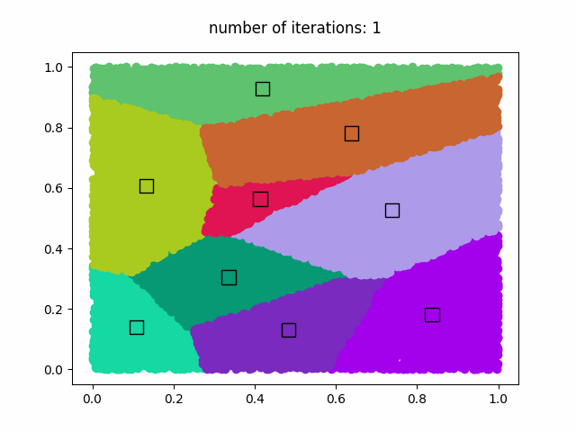

.. _example_clustering:

Example: Clustering
===================

.. contents:: :local:

Objective
---------

We will classify 1,000,000 datasets into 9 clusters by using k-means algorithm.
The number of iteration steps for k-means is 50.
After 50 iteration steps are computed, the GIF animation is saved as 'clustering.gif'.

Program
-------

.. code-block:: python

    import nlcpy as vp
    from matplotlib import pyplot as plt
    from matplotlib import animation

    N_SAMPLES  = 1000000  # The number of samples
    N_CLUSTERS =       9  # The number of clusters
    MAX_ITER   =      50  # The number of maximum iterations
    N_DRAW     =   20000  # The number of samples for drawing

    def draw(s, c, l, it):
        # Plot the samples and centroids of the fitted clusters into an image file.
        vp.random.seed(777)
        colors = vp.random.rand(N_CLUSTERS, 3).get()
        ind = vp.random.randint(0, N_SAMPLES, N_DRAW)
        s = s[ind]
        l = l[ind]
        ims = []
        im = plt.text(.5, 1.1, 'number of iterations: {}'.format(it + 1),
                      ha='center', va='bottom', fontsize='large')
        ims.append(im)
        for i in range(N_CLUSTERS):
            labels = s[l == i, :]
            im = plt.scatter(labels[:, 0], labels[:, 1], color=colors[i, :])
            ims.append(im)
        im = plt.scatter(
                c[:, 0], c[:, 1], s=120, marker='s', facecolors=colors,
                edgecolors='k')
        ims.append(im)
        return ims

    def kmeans():
        vp.random.seed(111)
        s = vp.random.rand(N_SAMPLES, 2)
        ind = vp.random.randint(0, N_SAMPLES, N_CLUSTERS)
        c = s[ind]  # Initial centroids
        label = vp.zeros(N_SAMPLES)

        fig = plt.figure()
        ims = []
        for i in range(MAX_ITER):
            # Estimate the distance and label for each sample
            d = vp.linalg.norm(s[None, :, :] - c[:, None, :], axis=2)
            label_new = vp.argmin(d, axis=0)
            if vp.all(label == label_new):
                break
            label = label_new

            # Compute the new centroid for each cluster
            mask = (label == vp.arange(N_CLUSTERS)[:, None])
            sums = vp.where(mask[:, None, :], s.T, 0).sum(axis=2)
            counts = mask.sum(axis=1).reshape((N_CLUSTERS, 1))
            c = sums / counts

            ims.append(draw(s, c, label, i))

        ani = animation.ArtistAnimation(fig, ims, interval=200, blit=True)
        ani.save("clustering.gif", writer='pillow')

    if __name__ == '__main__':
        assert N_SAMPLES >= N_CLUSTERS
        assert N_SAMPLES >= N_DRAW
        kmeans()

Result
------

This is the GIF animiation (clustering.gif).

Copyrights
----------

This example is based on the following code:
    https://github.com/cupy/cupy/blob/master/examples/kmeans/kmeans.py

.. seealso::
    :ref:`CuPy License <copyrights>`

