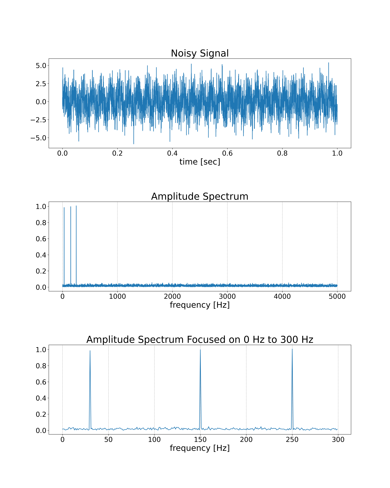

.. _example_spectrum:

Example: Spectrum Analysis
==========================

.. contents:: :local:

Objective
---------

We will analyze a spectrum of the noisy signal by using FFT.
The input signal contains 30Hz, 150Hz, and 250Hz sine waves and normally distributed random numbers.

Program
-------

.. code-block:: python

    import nlcpy as vp
    from matplotlib import pyplot as plt

    N  = 10000   # The number of samples
    DT = .0001   # The time step interval
    FREQS = [    # The list of frequencies to include in the signal
        30,
        150,
        250
    ]

    def gen_signal():
        T = vp.arange(0, N * DT, DT, dtype='f8')
        S = vp.zeros(N, dtype='f8')
        for f in FREQS:
            S += vp.sin(2 * vp.pi * f * T)
        # Add noise
        S += vp.random.randn(N)
        return T, S

    def analyze(S):
        A = vp.absolute(vp.fft.rfft(S)) / N * 2
        F = vp.fft.rfftfreq(N, d=DT)
        return A, F

    def gen_graph(T, S, A, F):
        fig, axes = plt.subplots(3, 1, figsize=(16, 20))
        axes[0].set_title('Noisy Signal', fontsize=28)
        axes[0].plot(T, S)
        axes[0].set_xlabel('time [sec]', fontsize=24)
        axes[0].tick_params(labelsize=20)

        axes[1].set_title('Amplitude Spectrum', fontsize=28)
        axes[1].plot(F[:], A[:])
        axes[1].set_xlabel('frequency [Hz]', fontsize=24)
        axes[1].grid(axis='x', linestyle='--')
        axes[1].tick_params(labelsize=20)

        axes[2].set_title('Amplitude Spectrum Focused on 0 Hz to 300 Hz', fontsize=28)
        axes[2].plot(F[:300], A[:300])
        axes[2].set_xlabel('frequency [Hz]', fontsize=24)
        axes[2].grid(axis='x', linestyle='--')
        axes[2].tick_params(labelsize=20)

        plt.subplots_adjust(hspace=0.6)
        plt.savefig('spectrum.png', dpi=300)

    if __name__ == '__main__':
        T, S = gen_signal()
        A, F = analyze(S)
        gen_graph(T, S, A, F)

Result
------

