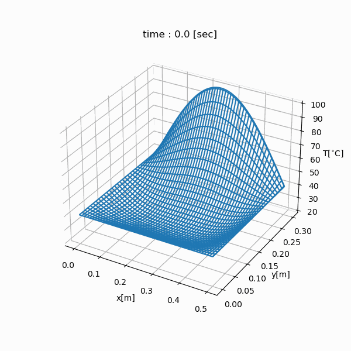

.. _example_thermal:

Example: Thermal Simulation
===========================

.. contents:: :local:

Objective
---------

We will simulate the temporal change in temperature of the copper rectangle whose length is 50 cm (= LX), width is 30 cm (= LY) using a finite-difference method.

Physics
-------

Governing Equation
^^^^^^^^^^^^^^^^^^

.. math::

    \frac{\partial}{\partial t} T=\frac{k}{\rho c}\left(\frac{\partial^2}{\partial x^2}+\frac{\partial^2}{\partial y^2}\right)T

================ =================
Variable         Description
================ =================
:math:`T`        Temperature [K]
:math:`t`        Time [s]
:math:`x`        x coordinate [m]
:math:`y`        y coordinate [m]
================ =================

============= ======================== ======================
Constant      Description              Value of Copper
============= ======================== ======================
:math:`k`     Thermal conductivity     398.0 [W/m K]
:math:`\rho`  Density                  8960.0 [kg/m `3`:sup:]
:math:`c`     Specific heat capacity   385.0 [J/kg K]
============= ======================== ======================

Boundary Conditions
^^^^^^^^^^^^^^^^^^^

.. math::

    \begin{eqnarray*}
      T &=& T_1  ~ (x=0, x={\rm LX}, y=0) \\
      T &=& T_1+T_2 \sin \frac{\pi x}{\mathrm LX} ~ (y={\rm LY}) \\
      \frac{\partial}{\partial x}T &=& 0 ~ (x=0, x={\rm LX}) \\
      \frac{\partial}{\partial y}T &=& 0 ~ (y=0, y={\rm LY}) \\
      T_1 &=& 40 ~ [^\circ C] \\
      T_2 &=& 60 ~ [^\circ C] \\
    \end{eqnarray*}

Initial Conditions
^^^^^^^^^^^^^^^^^^

.. math::

    \begin{eqnarray*} 
      T &=& T_0 \\
      T_0 &=& 20 ~ [^\circ C]
    \end{eqnarray*}

Program
-------

.. code-block:: python

    import nlcpy as vp
    from matplotlib import pyplot as plt
    from mpl_toolkits.mplot3d import Axes3D
    from matplotlib import animation
    from matplotlib.animation import PillowWriter
    
    LX = 50e-2
    LY = 30e-2
    T0 = 20.0
    T1 = 40.0
    T2 = 60.0
    HC = 398.0 / (8960.0 * 385.0)
    
    def initialize(grid):
        grid.fill(T0)
        grid[:, 0] = T1
        grid[:, -1] = T1
        grid[0] = T1
        grid[-1] = T1 + T2 * \
                vp.sin(vp.pi * vp.linspace(0, LX, grid.shape[1]) / LX)
    
    def compute(grid, coef, temp, mx, my):
        vp.multiply(grid[2:my, 1:mx-1], coef[0], out=temp)
        temp += grid[1:my-1, 2:mx] * coef[1]
        temp += grid[1:my-1, 1:mx-1] * coef[2]
        temp += grid[0:my-2, 1:mx-1] * coef[0]
        temp += grid[1:my-1, 0:mx-2] * coef[1]
        grid[1:my-1, 1:mx-1] = temp[...]
    
    def plot(grid, ax, ims):
        x = vp.linspace(0, LX, grid.shape[1])
        y = vp.linspace(0, LY, grid.shape[0])
        try:
            # meshgrid is not implemented yet.
            xx, yy = vp.meshgrid(x, y)
        except AttributeError:
            import numpy as np
            xx, yy = np.meshgrid(x, y)
    
        im = ax.plot_wireframe(xx, yy, grid, rstride=10, cstride=10)
        ims.append([im])
    
    def create_animation(fig, ims):
        ani = animation.ArtistAnimation(fig, ims, interval=200)
        ani.save("thermal_simulation.gif", writer='pillow')
    
    def heatequation(
            nx, # The number of grid points in X-direction.
            ny, # The number of grid points in Y-direction.
            dt, # The time step interval.
            mt, # The maximum number of time steps.
            kp, # The number of time steps for drawing interval.
        ):
        mx = nx + 2
        my = ny + 2
        grid = vp.empty((my, mx), dtype='f8')
        temp = vp.empty((ny, nx), dtype='f8')
    
        dx = LX / (nx + 1)
        dy = LY / (ny + 1)
    
        coef = [
            (HC * dt) / (dx * dx),
            (HC * dt) / (dy * dy),
            1.0 - HC * dt * (2.0 / (dx * dx) + 2.0 / (dy * dy)),
        ]
    
        print("initializing grid...", end="", flush=True)
        initialize(grid)
        print("done", flush=True)
    
        ims = []
        fig = plt.figure()
        ax = Axes3D(fig, rect=(0., 0., .95, 1.))
        ax.set_xlabel("x[m]")
        ax.set_ylabel("y[m]")
        ax.set_zlabel("T[$^{\circ}$C]")
        ax.zaxis.set_rotate_label(False)
        print("computing difference method...", end="", flush=True)
        for i in range(int(mt/dt)):
            compute(grid, coef, temp, mx, my)
            if i % int(kp/dt) == 0:
                plot(grid, ax, ims)
        print("done", flush=True)
    
        print("creating animation...", end="", flush=True)
        create_animation(fig, ims)
        print("done", flush=True)
    
    if __name__ == "__main__":
        heatequation(500, 300, 0.001, 30, 1.)

Simulation Result
-----------------

