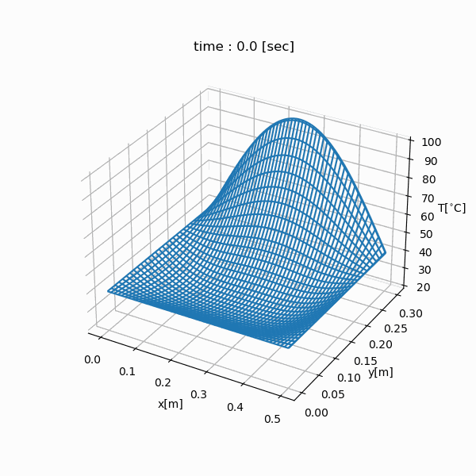

.. _example_thermal_sca:

Example: Thermal Simulation (SCA Implementation)
================================================

.. contents:: :local:

Objective
---------

We will simulate the temporal change in temperature of the copper rectangle whose length is 50 cm (= LX), width is 30 cm (= LY) using a finite-difference method.

Physics
-------

Governing Equation
^^^^^^^^^^^^^^^^^^

.. math::

    \frac{\partial}{\partial t} T=\frac{k}{\rho c}\left(\frac{\partial^2}{\partial x^2}+\frac{\partial^2}{\partial y^2}\right)T

================ =================
Variable         Description
================ =================
:math:`T`        Temperature [K]
:math:`t`        Time [s]
:math:`x`        x coordinate [m]
:math:`y`        y coordinate [m]
================ =================

============= ======================== ======================
Constant      Description              Value of Copper
============= ======================== ======================
:math:`k`     Thermal conductivity     398.0 [W/m K]
:math:`\rho`  Density                  8960.0 [kg/m `3`:sup:]
:math:`c`     Specific heat capacity   385.0 [J/kg K]
============= ======================== ======================

Boundary Conditions
^^^^^^^^^^^^^^^^^^^

.. math::

    \begin{eqnarray*}
      T &=& T_1  ~ (x=0, x={\rm LX}, y=0) \\
      T &=& T_1+T_2 \sin \frac{\pi x}{\mathrm LX} ~ (y={\rm LY}) \\
    \end{eqnarray*}

Initial Conditions
^^^^^^^^^^^^^^^^^^

.. math::

    \begin{eqnarray*}
      T &=& T_0 \\
    \end{eqnarray*}

Program
-------

.. code-block:: python

    import nlcpy as vp
    from matplotlib import pyplot as plt
    from matplotlib import animation

    LX = 50e-2
    LY = 30e-2
    T0 = 20.0
    T1 = 40.0
    T2 = 60.0
    HC = 398.0 / (8960.0 * 385.0)
    WFRAME = None
    DT = 'float32'

    def initialize(grid):
        grid.fill(T0)
        grid[:, 0] = T1
        grid[:, -1] = T1
        grid[0] = T1
        grid[-1] = T1 + T2 * \
            vp.sin(vp.pi * vp.linspace(0, LX, grid.shape[1]) / LX)

    def create_stencil_kernel(grid_work1, grid_work2, coef):
        kernels = []
        dgrid1, dgrid2 = vp.sca.create_descriptor((grid_work1, grid_work2))
        # input: grid_work1, output: grid_work2
        desc = ((dgrid1[0, -1] + dgrid1[0, 1]) * coef[0] +
                (dgrid1[-1, 0] + dgrid1[1, 0]) * coef[1] +
                dgrid1[0, 0] * coef[2])
        kernels.append(vp.sca.create_kernel(desc, desc_o=dgrid2[0, 0]))
        # input: grid_work2, output: grid_work1
        desc = ((dgrid2[0, -1] + dgrid2[0, 1]) * coef[0] +
                (dgrid2[-1, 0] + dgrid2[1, 0]) * coef[1] +
                dgrid2[0, 0] * coef[2])
        kernels.append(vp.sca.create_kernel(desc, desc_o=dgrid1[0, 0]))

        return kernels

    def heatequation(
            nx,  # The number of grid points in X-direction.
            ny,  # The number of grid points in Y-direction.
            dt,  # The time step interval.
            mt,  # The maximum number of time steps.
            kp,  # The number of time steps for drawing interval.
    ):
        mx = nx + 2
        my = ny + 2
        grid_work1 = vp.sca.create_optimized_array((my, mx), dtype=DT)
        grid_work2 = vp.sca.create_optimized_array((my, mx), dtype=DT)

        dx = LX / (nx + 1)
        dy = LY / (ny + 1)

        coef = [
            (HC * dt) / (dx * dx),
            (HC * dt) / (dy * dy),
            1.0 - HC * dt * (2.0 / (dx * dx) + 2.0 / (dy * dy)),
        ]

        x = vp.linspace(0, LX, mx)
        y = vp.linspace(0, LY, my)
        xx, yy = vp.meshgrid(x, y)

        print("initializing grid...", end="", flush=True)
        initialize(grid_work1)
        grid_work2[...] = grid_work1
        print("done", flush=True)

        print("creating stencil kernel...", end="", flush=True)
        kernels = create_stencil_kernel(grid_work1, grid_work2, coef)
        print("done", flush=True)

        grid_for_plot = [grid_work1, ]
        fig = plt.figure(figsize=(6, 6))
        ax = fig.add_subplot(111, projection='3d')
        print("computing difference method...", end="", flush=True)
        for i in range(int(mt/dt)):
            grid = kernels[i % 2].execute()
            if i % int(kp/dt) == 0:
                grid_for_plot.append(grid.get())
        print("done", flush=True)

        def animate(i):
            global WFRAME
            if WFRAME:
                ax.collections.remove(WFRAME)
            WFRAME = ax.plot_wireframe(
                xx, yy, grid_for_plot[i], rstride=10, cstride=10)
            ax.set_title('time : {:2.1f} [sec]'.format(i * kp))

        def animate_init():
            ax.set_xlabel("x[m]")
            ax.set_ylabel("y[m]")
            ax.set_zlabel("T[$^{\circ}$C]")
            ax.zaxis.set_rotate_label(False)
            ax.set_zlim(T0, T1 + T2)

        print("creating animation...", end="", flush=True)
        animation.FuncAnimation(
            fig,
            animate,
            interval=200,
            frames=int(mt / kp + 1),
            repeat=False,
            init_func=animate_init
        ).save(
            "thermal_simulation.gif",
            writer='pillow'
        )
        print("done", flush=True)

        for kern in kernels:
            vp.sca.destroy_kernel(kern)

    if __name__ == "__main__":
        heatequation(500, 300, 0.001, 30, 1.)

Simulation Result
-----------------

