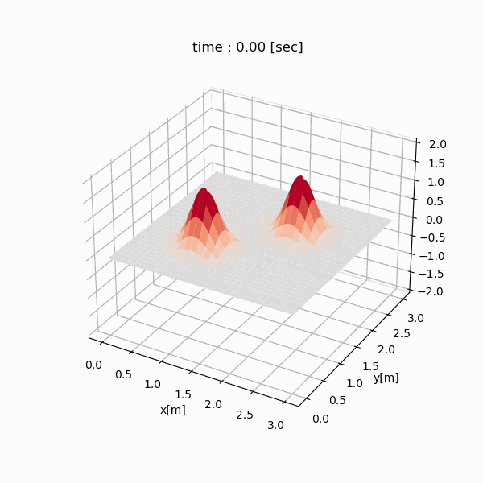

.. _example_wave:

Example: Wave Simulation
========================

.. contents:: :local:

Objective
---------
We will simulate the wave propagation on a 3 m :math:`\times` 3 m two-dimensional plane.

Physics
-------

Governing Equation
^^^^^^^^^^^^^^^^^^

.. math::

    \frac{\partial^2}{\partial t^2} u=c^2\left(\frac{\partial^2}{\partial x^2}+\frac{\partial^2}{\partial y^2}\right)u

================ =================
Variable         Description
================ =================
:math:`u`        Amplitude
:math:`t`        Time [s]
:math:`x`        x coordinate [m]
:math:`y`        y coordinate [m]
================ =================

============= ======================== =============
Constant      Description              Value
============= ======================== =============
:math:`c`     Propagation Speed        1.0 [m/sec]
============= ======================== =============

Boundary Conditions
^^^^^^^^^^^^^^^^^^^

The amplitude at all boundaries is constantly 0.

Program
-------

.. code-block:: python

    import nlcpy as vp
    from matplotlib import pyplot as plt
    from matplotlib import animation

    LX = 3
    LY = 3
    NX = 300
    NY = 300
    DT = .005
    MT = 3
    KP = .02
    C = 1.
    DX = LX / (NX + 1)
    DY = LY / (NY + 1)
    MX = NX + 2
    MY = NY + 2
    DTYPE = 'float32'
    XX, YY = vp.meshgrid(
        vp.linspace(0, LX, MX),
        vp.linspace(0, LY, MY)
    )
    SURFACE = None

    def gaussian(x, y, mu, sigma):
        distribution = 1 / vp.sqrt(2 * vp.pi * sigma * sigma) * \
            vp.exp(-(x - mu) ** 2 / (2 * sigma * sigma)) * \
            vp.exp(-(y - mu) ** 2 / (2 * sigma * sigma))
        return distribution / vp.absolute(distribution.max())

    def initialize(grid):
        grid[...] = 0
        grid[...] += gaussian(XX, YY, 2 * LX / 3, .2) * 1.5
        grid[...] += gaussian(XX, YY, 1 * LX / 3, .2) * 1.5

    def create_stencil_kernel(g_tm1, g_t, g_tp1, coef):
        dg_tm1, dg_t, dg_tp1 = vp.sca.create_descriptor((g_tm1, g_t, g_tp1))
        desc = (dg_t[0, 0] * coef[0] -
                dg_tm1[0, 0] * coef[1] +
                (dg_t[0, -1] + dg_t[0, 1]) * coef[2] +
                (dg_t[-1, 0] + dg_t[1, 0]) * coef[3])
        return vp.sca.create_kernel(desc, desc_o=dg_tp1[0, 0])

    def wave_equation():
        grid0 = vp.sca.create_optimized_array((MY, MX), dtype=DTYPE)
        grid1 = vp.sca.create_optimized_array((MY, MX), dtype=DTYPE)
        grid2 = vp.sca.create_optimized_array((MY, MX), dtype=DTYPE)

        coef = [
            (1 - (C * C * DT * DT) / (DX * DX) -
             (C * C * DT * DT) / (DY * DY)) * 2,
            1,
            (C * C * DT * DT) / (DX * DX),
            (C * C * DT * DT) / (DY * DY)
        ]

        print("initializing grid...", end="", flush=True)
        initialize(grid0)
        grid1[...] = grid0[...]
        grid2[...] = grid0[...]
        print("done", flush=True)

        print("creating stencil kernel...", end="", flush=True)
        kernels = []
        kernels.append(create_stencil_kernel(grid0, grid1, grid2, coef))
        kernels.append(create_stencil_kernel(grid1, grid2, grid0, coef))
        kernels.append(create_stencil_kernel(grid2, grid0, grid1, coef))
        print("done", flush=True)

        fig = plt.figure(figsize=(6, 6))
        ax = fig.add_subplot(111, projection='3d')
        grid_for_plot = [grid0.get(), ]
        print("computing difference method...", end="", flush=True)
        for i in range(int(MT/DT)):
            grid_current = kernels[i % 3].execute()
            if i % int(KP/DT) == 0:
                grid_for_plot.append(grid_current.get())
        print("done", flush=True)

        def animate(i):
            global SURFACE
            if SURFACE:
                ax.collections.remove(SURFACE)
            SURFACE = ax.plot_surface(
                XX, YY, grid_for_plot[i], rstride=10, cstride=10,
                cmap=plt.cm.coolwarm, vmax=1, vmin=-1)
            ax.set_title('time : {:2.2f} [sec]'.format(i * KP))

        def animate_init():
            ax.set_xlabel("x[m]")
            ax.set_ylabel("y[m]")
            ax.set_zlim(-2, 2)

        print("creating animation...", end="", flush=True)
        animation.FuncAnimation(
            fig,
            animate,
            frames=int(MT / KP + 1),
            interval=50,
            repeat=False,
            init_func=animate_init
        ).save(
            "wave_simulation.gif",
            writer='pillow',
        )
        print("done", flush=True)

        for kern in kernels:
            vp.sca.destroy_kernel(kern)

    if __name__ == "__main__":
        wave_equation()

Simulation Result
-----------------

