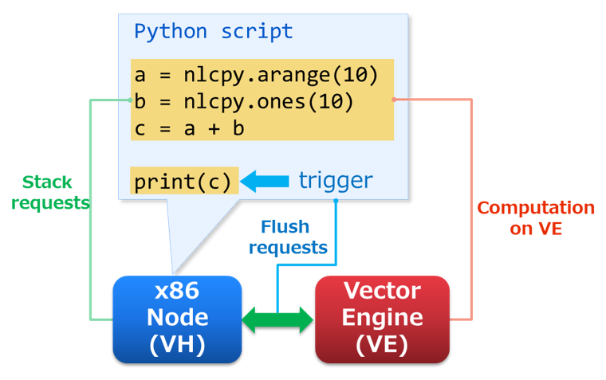

.. _lazy:

Lazy Evaluation
===============

.. contents:: :local:

Overview
--------

SX-Aurora TSUBASA consists of an x86 Node (VH) and Vector Engines (VE), which are directly connected with PCI Express.
When data transfer between VH and VE frequently appears in Python scripts, its performance becomes significantly lower.
In other words, the overhead between VH and VE is quite an important issue to make Python scripts performed faster.
As a solution for it, NLCPy evaluates Python scripts lazy to collectively transfer computational requests to VE.
It can reduce the number of times that the requests are offloaded to VE.

Evaluation sequence is as follows:

1. Stack requests on VH.
2. Flush the requests to VE when a trigger appears in Python scripts.
3. Start computations on VE based on the requests and wait until computations will be completed.

Request Management
------------------

In NLCPy functions, the requests shown above are automatically flushed to VE and are executed on VE.
The triggers that cause to flush the requets are as follows:

* | When array data on VE are needed on VH.

    e.g.) print :class:`nlcpy.ndarray`, call :class:`nlcpy.ndarray.get()`, and use :class:`nlcpy.ndarray` in an ``if``/``elif`` conditional statement.

* | When the number of stacked requests on VH exceeds 100.

* | When a Python script calls a function in which the lazy evaluation is not supported.

    e.g.) :func:`nlcpy.fft.fft()`, :func:`nlcpy.linalg.solve()`, and so on.
        
:func:`nlcpy.request.flush()` can intentionally flush the requests. 
In addition, if your script calls :func:`nlcpy.request.set_offload_timing_onthefly()`, 
subsequent requests are executed on the fly. For details how to manage the 
requests, please see :mod:`nlcpy.request`.

Debugging Tips
--------------

When using lazy evaluation, the position of warnings where your Python script raised may not be accurate.
So if you want to know the exact position of warnings, we recommend using :func:`nlcpy.request.set_offload_timing_onthefly()`.

* **Warning example with "lazy"**

    .. code-block:: python

        # sample.py
        import nlcpy as vp
        a = vp.divide(1, 0) # divide by zero warning
        b = a + 1
        print(b)

    ::

        $ python sample.py
        sample.py:5: RuntimeWarning: divide by zero encountered in nlcpy.core.core
          print(b)
        inf

* **Warning example with "on-the-fly"**

    .. code-block:: python

        # sample.py
        import nlcpy as vp
        vp.request.set_offload_timing_onthefly()
        a = vp.divide(1, 0) # divide by zero warning
        b = a + 1
        print(b)

    ::

        $ python sample.py
        sample.py:4: RuntimeWarning: divide by zero encountered in nlcpy.core.core
          a = vp.divide(1, 0) # divide by zero warning
        inf

Performance Comparison between "on-the-fly" and "lazy"
------------------------------------------------------

Here, we show a simple performance comparison between "on-the-fly"
(``set_offload_timing_onthefly``) and "lazy" (``set_offload_timing_lazy``).

In this sample program, the use of "lazy" improves performance about 2 times.

* **Sample Program**

    .. code-block:: python

        # comparison.py
        import nlcpy as vp
        import time

        N = 10000

        timings = [
            vp.request.set_offload_timing_onthefly,
            vp.request.set_offload_timing_lazy,
                  ]

        for t in timings:
            t() # set offload timing
            print(vp.request.get_offload_timing())
            x = vp.zeros(N, dtype='i8')
            vp.request.flush()
            begin = time.time()
            for i in range(N):
                x[i] += i
            vp.request.flush()
            end = time.time()
            print(x)
            print("elapsed time =", end - begin, "\n")

* **Execution Result**

    ::

        $ python comparison.py
        current offload timing is 'on-the-fly'
        [   0    1    2 ... 9997 9998 9999]
        elapsed time = 1.168030023574829

        current offload timing is 'lazy'
        [   0    1    2 ... 9997 9998 9999]
        elapsed time = 0.5217337608337402
