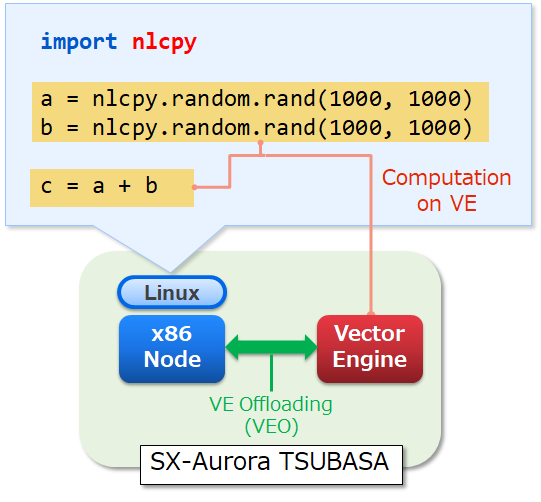

.. _userguide:

User's Guide
============

.. currentmodule:: nlcpy

NLCPy is a library for accelerating performance of Python scripts using NumPy on SX-Aurora TSUBASA. Python programmers can use this library on Linux/x86 of SX-Aurora TSUBASA. NLCPy's API is designed based on NumPy's one. The current version provides a subset of NumPy's API.

NLCPy enables Python scripts to compute on a Vector Engine (VE) of SX-Aurora TSUBASA by VE offloading. To gain the performance on VE, NLCPy uses the functions of NEC Numeric Library Collection (NLC), which are highly optimized for VE.

.. toctree::
    :maxdepth: 1

    installation
    usage/index
    functions
    lazy
    notices
    example/index
    building_docs
    copyrights
